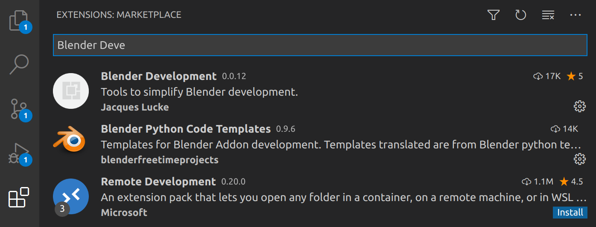
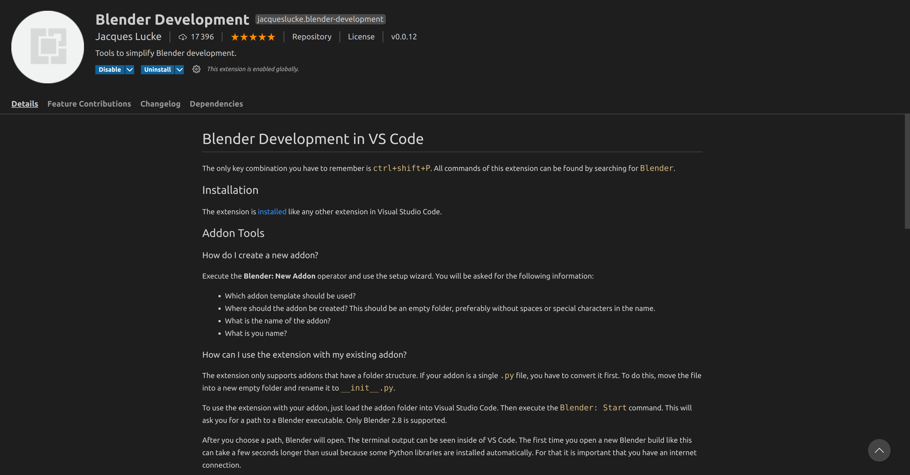

# Quantum Nodes
This is an extension of [Animation Nodes](https://github.com/JacquesLucke/animation_nodes) for [Blender](https://github.com/blender).

Quantum Nodes provides you amazing tools to incorporate quantum computation into your creation process. It even allows you to send your quantum circuits to real qubits provided by [IBM](https://www.ibm.com/quantum-computing/experience).

Built using [Qiskit](https://github.com/Qiskit) and [Anaconda](https://github.com/Anaconda-Platform)

## Table of contents :bookmark_tabs:
1. Installation
   * [Linux](#linux)
   * [Windows]()
   * [Mac]()
2. Contribute to our project

### Installation :computer:
#### Linux
1. Downloading everything (almost)
2. Pre-requisite installations
3. Installation of the Blender add-ons

###### Downloading everything
* <ins>Download *Blender*</ins>
  You can do it from the website, but doing it using the terminal is recommended for this tutorial.
  Through the website:

  

  Using the terminal:
  * `sudo add-apt-repository ppa:thomas-schiex/blender`
  * `sudo apt-get update`
  * `sudo apt-get install blender`
* <ins>Download *Anaconda*</ins>
  Again, you can do it from the website, but doing it using the terminal is recommended for this tutorial.
  From the website: https://www.anaconda.com/products/individual#linux

  

  Using the terminal:
  * `cd /tmp`
  * `curl https://repo.anaconda.com/archive/Anaconda3-2020.11-Linux-x86_64.sh --output anaconda.sh`
  See available versions [here](https://docs.anaconda.com/anaconda/install/hashes/lin-3-64/)
  * (Recommended) Compare your hash: `sha256sum anaconda.sh`
  See official hashes [here](https://docs.anaconda.com/anaconda/install/hashes/lin-3-64/)
  * `bash anaconda.sh`
  * During the installation:
  → Do you approve the license terms? [yes|no] → “yes”
  → Anaconda3 will now be installed into this location: in this tutorial, we use the default location.
  → Do you wish the installer to initialize Anaconda3 → “yes”
  * `source ~/.bashrc`
* <ins>Download *Animation Nodes*</ins>
  From the website: https://animation-nodes.com/#download

  

  

* <ins>Download *Quantum Nodes*</ins>
  Download it from our repository

  

###### Pre-requisite installations
* <ins>Install *Blender*</ins>
  * If downloaded from the website (not recommended here):
  → As [mentioned here](https://docs.blender.org/manual/en/latest/getting_started/installing/linux.html), uncompress the content of the downloaded .tar.xz at the desired location (e.g. ~/software or usr/local)
  * If downloaded using the terminal: it's already done :ok_hand:

  → Launch it to check if everything went well :wink:
  
* <ins>Install *Anaconda*</ins>
  * If downloaded through the web page :
    * Open a new terminal where you saved the file and enter: `bash Anaconda3-2020.11-Linux-x86_64.sh`
    * During the installation:
      → Do you approve the license terms? [yes|no] → “yes”
      → Anaconda3 will now be installed into this location: in this tutorial, we use the default location.
      → Do you wish the installer to initialize Anaconda3 → “yes”
    * At the end: `source ~/.bashrc`
  * If downloaded using the terminal: it's already done :ok_hand:

* <ins>*Anaconda* environment and *Blender*</ins>
  In this part, we will create a new conda environment, install the necessary packages and then, tell *Blender* to use our environment instead of the python that comes with by default.
  * Open a new terminal
    Go where your Blender installation files are. By default (when installed using the terminal), the files are located here: `cd /usr/share/blender/2.91/`
  * Deactivate the current python version: `mv python _python`
  * Create a new anaconda environment:
    **Warning**: as [mentioned here](https://docs.blender.org/api/current/info_tips_and_tricks.html), the python version ([major and minor](https://linuxize.com/post/how-to-check-python-version/)) must match the one that Blender comes with. For *Blender* 2.91.2, python 3.7 is ok.
    → Enter : `conda create --name=blender python=3.7`
    → During the installation, type `y` to proceed when `Proceed ([y]/n) ?` appears.
    → When the installation is finished, enter: `conda activate blender`
  * Link the conda environment to Blender:
    If you have installed *Anaconda* with the default parameters as we did in this tutorial, your conda env’ should be installed here : ~/anaconda3/envs/blender/
    → Enter in the terminal (replace with your custom path) :
    `sudo ln -s ~/anaconda3/envs/blender/ .` ← **⚠** don’t forget the `space` + `.` at the end
    This creates a junction between the python folder in the Blender files and the folder in the *Anaconda* environments files.
    → Rename this junction : `sudo mv blender python`
  * Install the needed python packages for *Quantum Nodes*:
    ```
    pip install pillow
    pip install scipy
    pip install qiskit
    ```
  * Then, open *Blender*, go to scripting and type in the python console: `import qiskit`
    If Blender **does not** find Qiskit, you need to follow the next steps:
    → Go here (using the terminal): `cd ~`
    → Enter: `sudo nano .bashrc`
    → Go at the end of the file (using the arrows) and add this in a new line: `export PYTHONNOUSERSITE=True`
    → Close the document : (`ctrl + x` then `y` and `enter`)
    Reopen *Blender*, it should now find Qiskit.

###### Installation of the Blender add-ons
* <ins>Preparations</ins>
  * Extract “quantum_nodes” folder from: `quantum-creative-master-quantum_nodes.zip`
  
  

  * The problem is that *Gitlab* encapsulates the downloaded folder inside another folder so *Blender* can not see it.
  Zip the extracted folder:

  

  

* <ins>In *Blender*</ins>
  * Open *Blender*
  Go in: `edit > preferences`

  

   * Go to the add-on panel and click on `install`
    
  

  * Select *Animation Nodes*
  
  

  * Click on `install add-on`. Don't forget to activate it (click on the checkbox):

  

  * Repeat the three last steps to install *Quantum Nodes*
  
  **The end, enjoy** :blush:

## Contribute to our project :wrench:

If you want to contribute you can use your favorite IDE our you can use Visual Studio Code that has a very interesting Extension for Blender Development made by Jacques Lucke :

* First you have to clone our repo
* Open Visual Studio Code and install *Blender Development* :



* Then you can follow the extension tutorial to set-up the "Blender: Start" directly from VS Code :



Like this any updates you want to do will be taken into account when you save a file. You don't have to import again any ZIP file into Blender, the extension does it for you.

