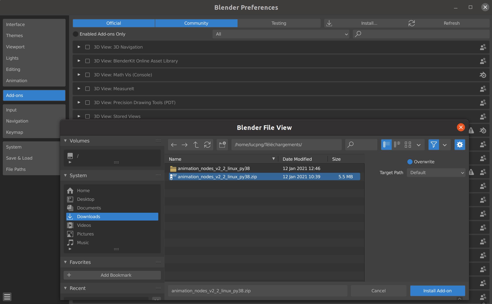

# Quantum Creative
Project of a Blender add-on in Python 3 using Qiskit.

## Installation
### Animation Nodes
Follow these steps to use Animation Nodes :

* First download Animation Nodes from the official website : https://animation-nodes.com/
* Install it in Blender Preferences Panel (go to Edit/Preferences/Add-Ons) :

### Quantum Creative
#### Prerequisite

Qiskit has to be installed on your machine and Blender has to use your version of Python. If it is not done yet you can follow the step by step tutorial in *Bundled Python & Extensions* on : https://docs.blender.org/api/current/info_tips_and_tricks.html

#### On Linux

* Download the ZIP file from Gitlab

* Copy the content of the sockets folder in /home/username/.config/blender/2.91/scripts/addons/animation_nodes/sockets

* Then do the same as Animation Nodes and install our extension in Blender

