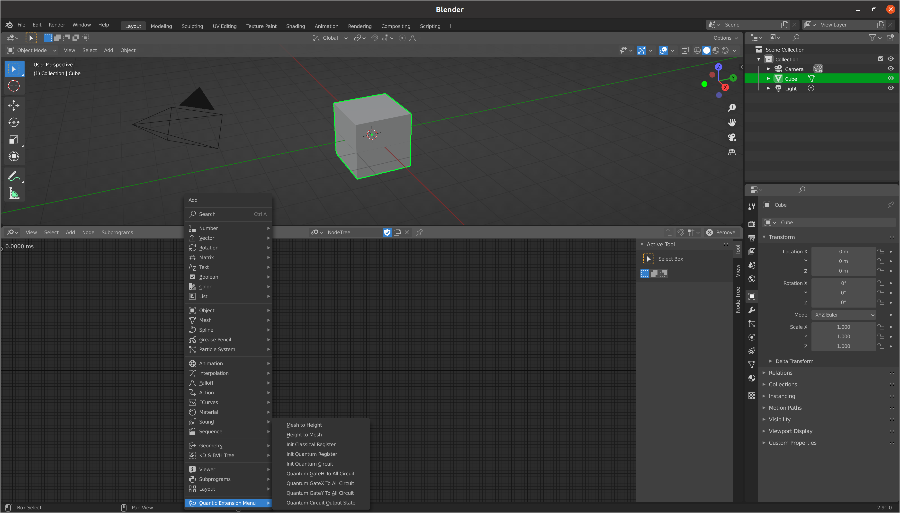

# Quantum Creative
Project of a Blender add-on in Python 3 using Qiskit.

## Installation
### Animation Nodes
Follow these steps to use Animation Nodes :

* First download Animation Nodes from the official website : https://animation-nodes.com/
* Install it in Blender Preferences Panel (go to Edit/Preferences/Add-Ons) :

### Quantum Creative
#### Prerequisite

Qiskit and PIL have to be installed on your machine (*pip install qiskit && pip install pillow*) and Blender has to use your version of Python. If it is not done yet you can follow the step by step tutorial :

#### On Linux

* Download the ZIP file from Gitlab
* Copy the content of quantum-creative/an_quantic/sockets in /home/*username*/.config/blender/2.91/scripts/addons/animation_nodes/sockets

* Then do the same as Animation Nodes and install our extension in Blender

* Finally, you can find our extension in the Animation Nodes Panel and start messing around with it ! More nodes and features will be available in next updates. 

